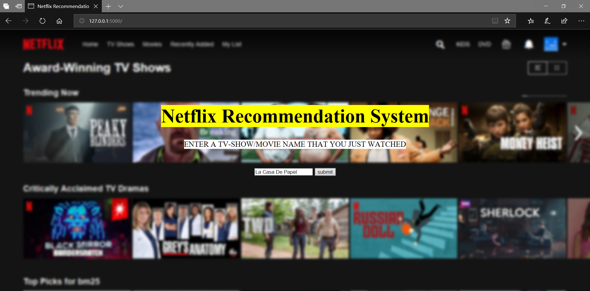

# Flask-Netflix-Recommendation-System

A flask web-app which can be used to get recommendations for a tv-show/movie, the app recommends a list of media according to the input.

1. Main Page
   Main Page
   Users can enter a movie/show title (e.g., "La Casa De Papel").

2. Recommendation Page
   Recommendation Page
   The app displays recommendations like "Elite" for Spanish Netflix originals.

## Technologies Used 💻

Backend: Flask (Python)

Frontend: HTML, CSS, JavaScript

ML/Data: Pandas, NumPy, Scikit-learn

Vesion Control: Git, GitHub

## Screenshot 1 : Main Page

Here the user can enter their movie of choice, for example I have entered La Casa De Papel a Spanish Netflix original show.

## Screenshot 2 : Recommendation Page

Here the user will get recommendations, for example I recieved Elite(another spanish Netflix original) as my top recommendation

## Contributing 🤝

Fork the repository.

Create a new branch:
`git checkout -b feature/your-feature.`

Commit changes:
`git commit -m "Add your feature".`

Push to the branch:
`git push origin feature/your-feature.`

Submit a pull request.

## License 📄

This project is licensed under the MIT License. See LICENSE for details.

## Acknowledgements 🙏

Dataset: Kaggle Netflix Movies and TV Shows

KASHI VISHWANATH
